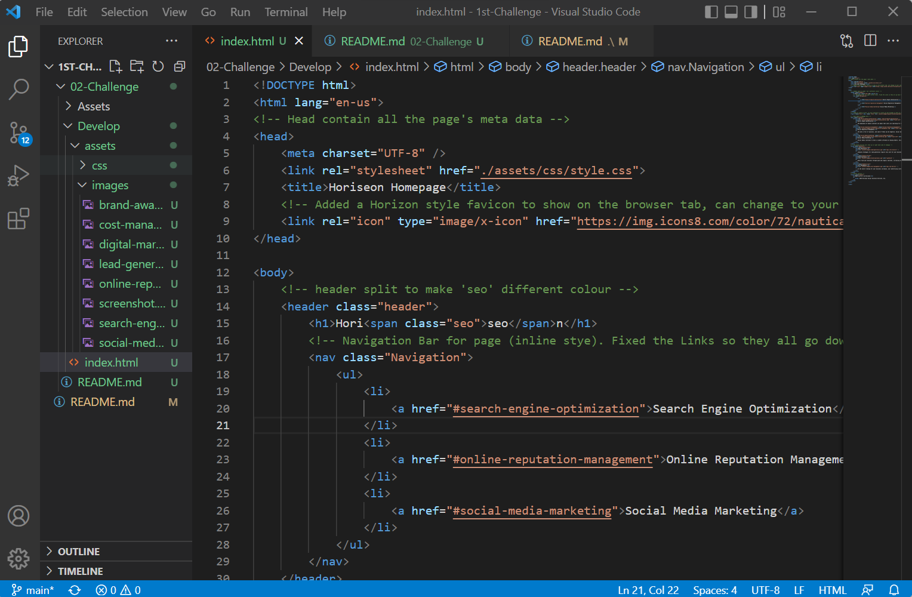

# 1st-Challenge

## Objectives
I was approached by Horiseon who wanted their webpage to be refactored in order to meet accessibility standards, so that it is Optimized for search engines.

## Approach

On this challenge I started by getting rid of all the non-semantic 'div' tags. I replaced them all with semantic tags such as 'header', 'footer', 'aside' etc. This not only helps with SEO but also makes the website accessible to people with visual disabilities as the screen-readers work better with the use of semantic tags.

I then went through each Image in turn and assigned them all an 'alt' attribute. This again helps people with disabilities as it can be sued to describe the image. The 'hero' image was sourced through the CSS file originally so I changed it so that it is now sourced through the HTML file so that I could put a 'alt' against this image too (this initially threw up an issue where the image was HUGE as it lost its CSS properties but by assigning the img to the .hero selector it reverted back to its proper size). I also added a favicon that resembles a horizon as an added extra and will see if the client likes this one or if they want to add their own company logo.

I then checked that all the headers fall in sequential order as this also helps assist screen-readers. This I found to be correct as the main heading was a 'h1', the headers for the main articles were 'h2' and the side articles were all 'h3'. I also changed the title in the 'head' section to 'Horiseon Homepage' as this is a concise but meaningful tag for it.

To further assit the client I added comments throughout the HTML code, highlighting what each of the main sections was. I also added a number of comments in the CSS section to draw attention to the changes I made here. These changes brought the CSS selectors in line with the semantic strucutre of the HTML elements and where possible I also consolidated selectors for similar elements which had identical CSS properties, making the code shorter and easier to read (also if any changes need to made in future to these elements they can all be targeted at once rather than having to do 3 times over.)

Lastly, I spotted that the 'Search Engine Optimization' link at the top of the page did not work. I saw that this was beacuse the search-engine-optimization element had a class but was missing an ID. So I added an ID and linked the nav bar at the top to the article lower down the page.

## Images

The website now looks like this which exactly matches the mock-up given to me by Horiseon

    

## Credits

I used w3 schools to help with CSS consolidation and also for help with exactly what tags are semantic and non-semantic

